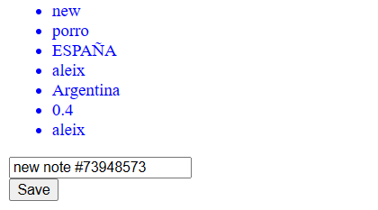
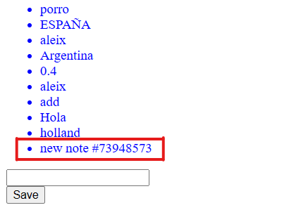
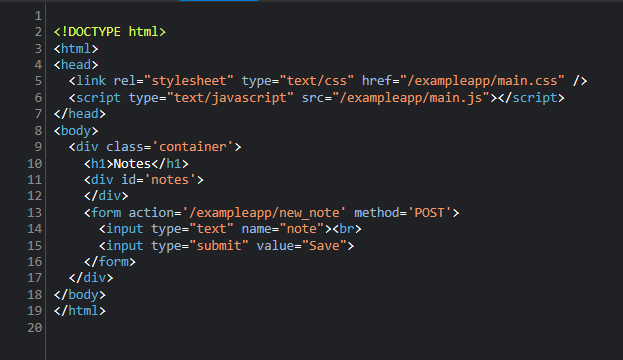
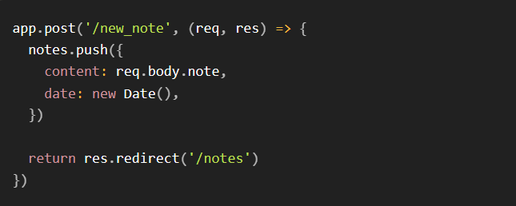
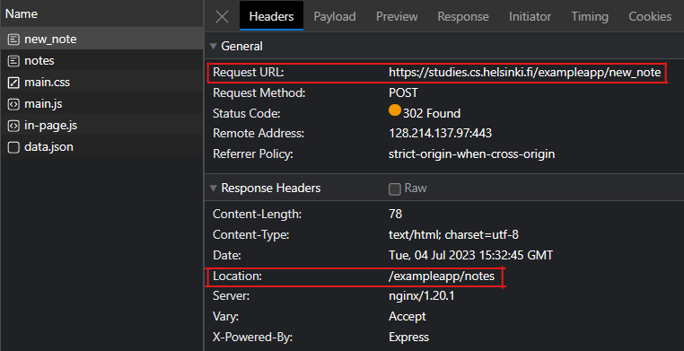
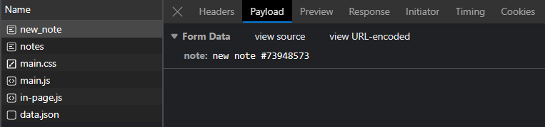
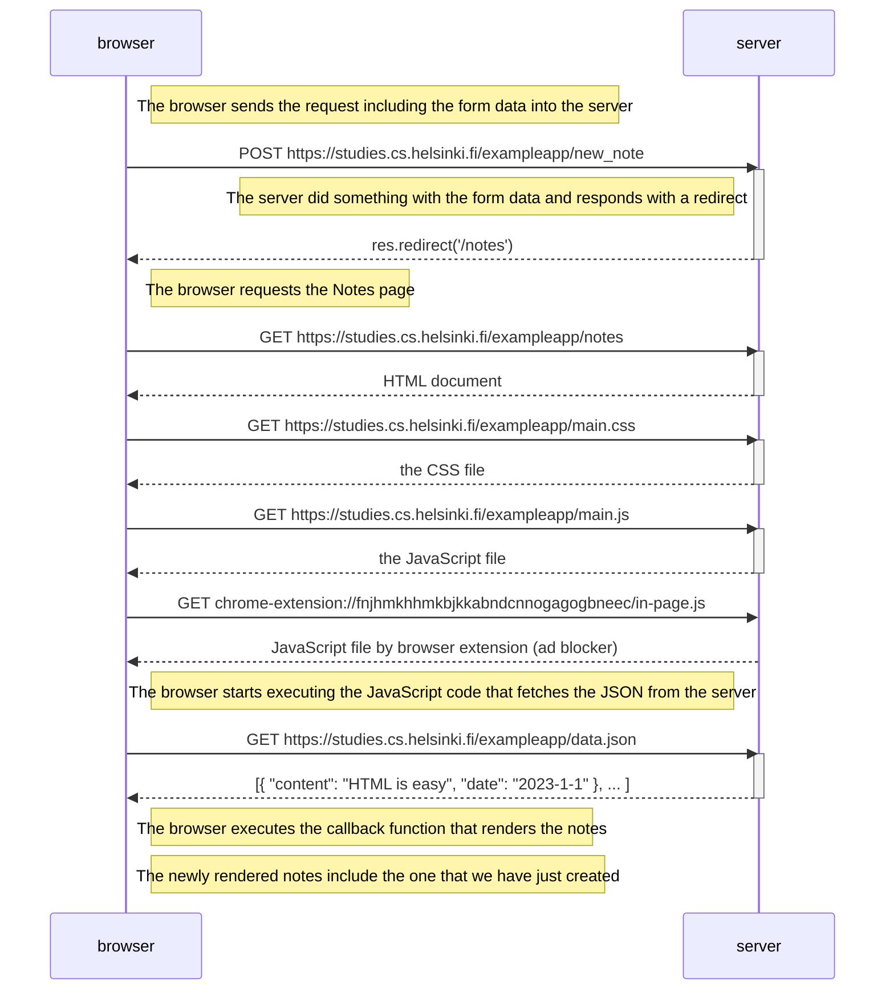

# Creating a new "note"
### *Create a diagram depicting the situation where the user creates a new note on the page https://studies.cs.helsinki.fi/exampleapp/notes by writing something into the text field and clicking the submit button.*
 

After [loading the Notes page](loading-the-notes-page.md), we can create a new note by writing something into the text field and clicking the submit button.

We can see in its markup that the input field and the submit button are in a form.

When the 'save' button was clicked, a POST request was made in the 'exampleapp/new_note' route. The server processed the request with this code:

Notice that following the manipulation of the notes array, the server responded by redirecting to the Notes page.

In the browser's developer tool, these are the requests after the creation of a new note.

 

The form data within the Payload tab:

 

## Mermaid

The sequence diagram for this is very similar to loading the Notes page. The only difference is that we begin by creating a POST request. After this request is finished, we just load the Notes page again but now we have created a new note.

