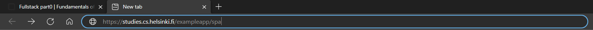
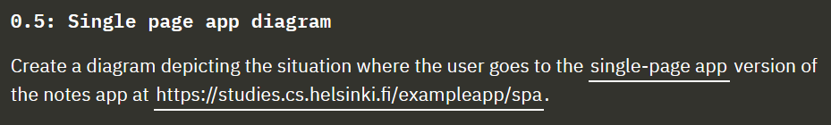
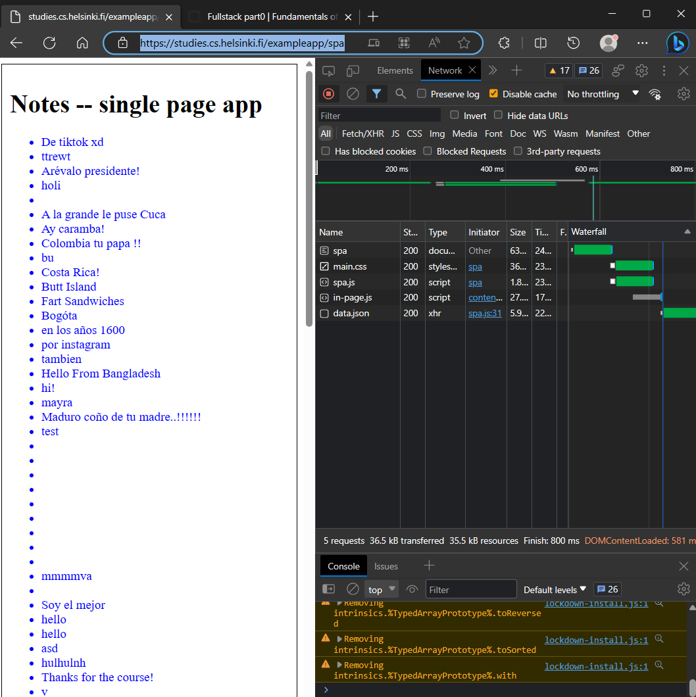
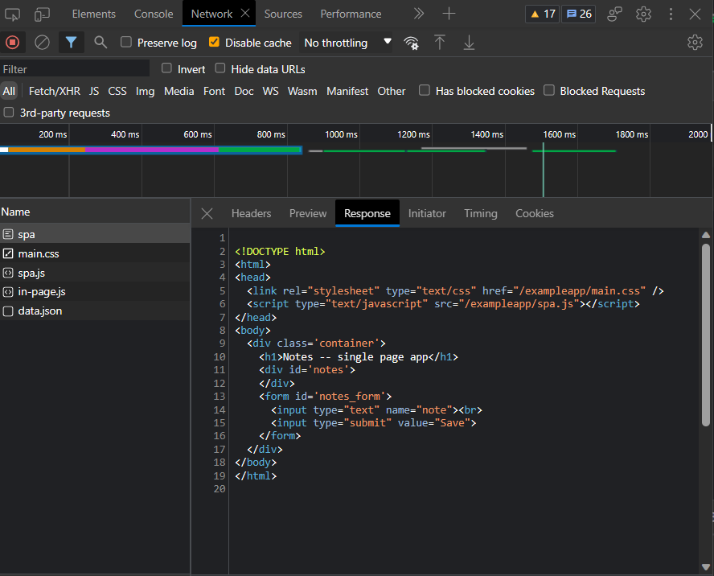
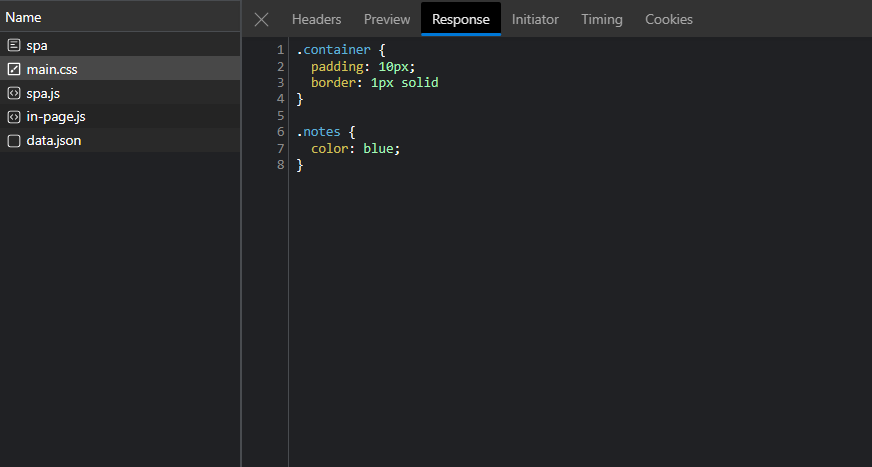
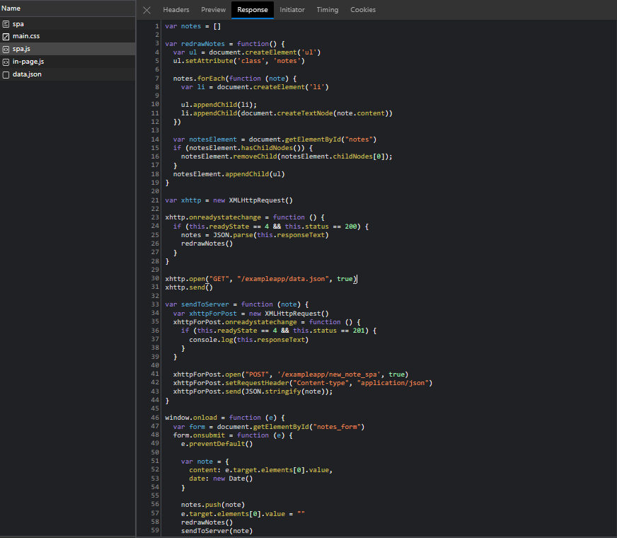
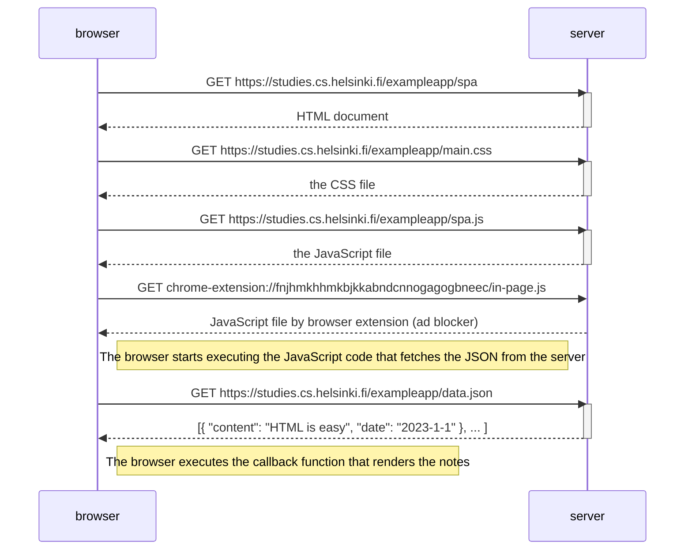

# Loading the "Notes", single-page version
### *Create a diagram depicting the situation where the user goes to the single-page app version of the notes app at https://studies.cs.helsinki.fi/exampleapp/spa.*
<br>
We can make a request in our browser to go to a website using the address bar,



or we can click a hyperlink



This is what the dev tool network tab looks like after the request:



The html document is served and it is structured like this:



The head of the document contains link for a style sheet and for the script. Because I have an ad blocker, in-page.js was also made as a request from the extension. 

So when the stylesheet was loaded, these css rules were applied to the document.



then the JavaScript files are executed, the spa.js code includes fetching of the JSON file ```xhttp.open("GET", "exampleapp/data.json", true)``` from the server



when the JSON file is received, it is parsed and redrawNotes() function is called — the browser has the notes and renders them.

<br>

## Mermaid

This is the sequence diagram for the loading of Notes, single-page version. 

