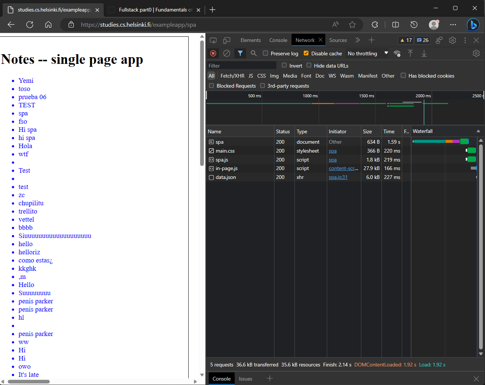
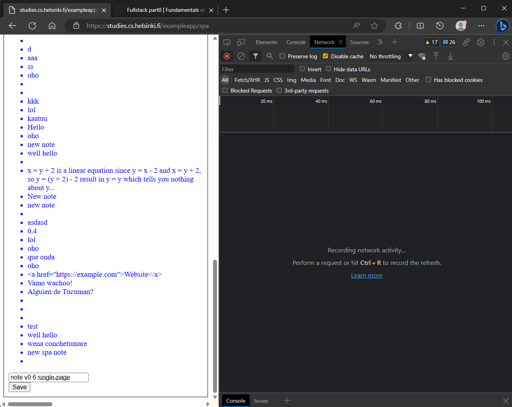
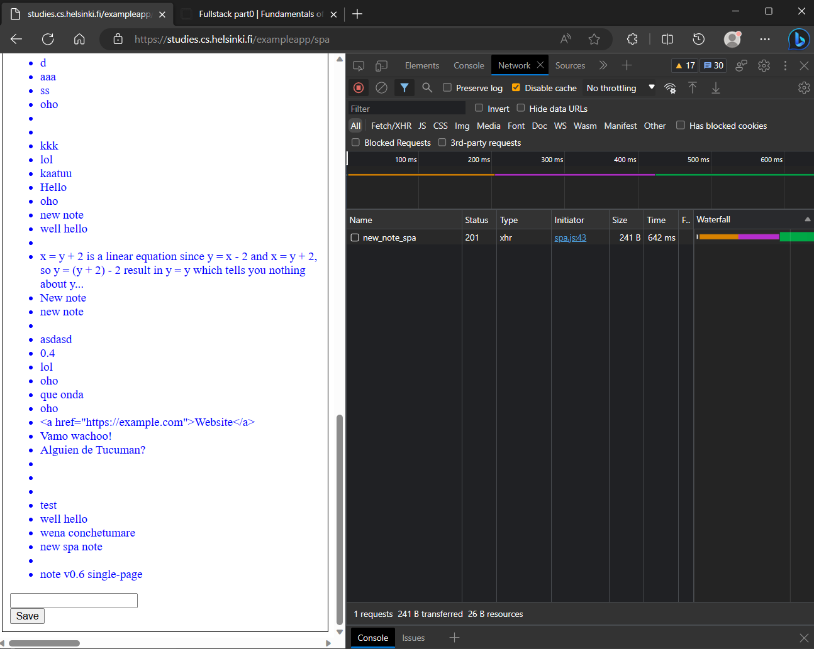
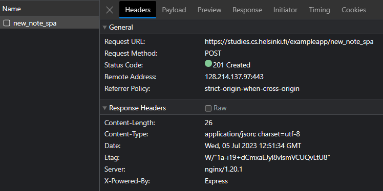
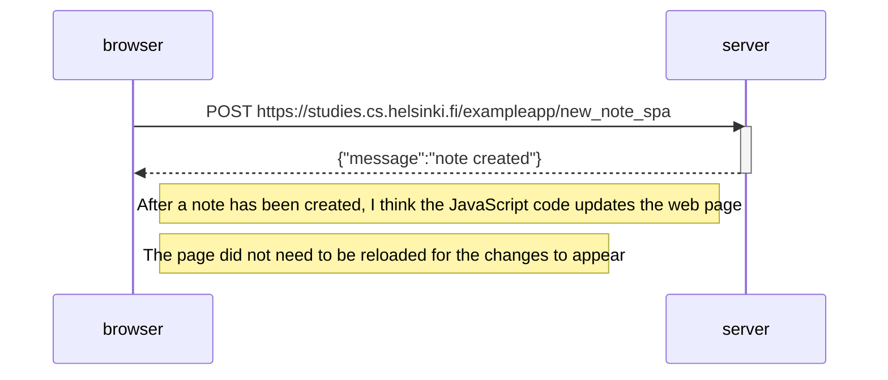

# Creating a new "note" in single-page app
### *Create a diagram depicting the situation where the user creates a new note using the single-page version of the app.*
 

Once the [Notes (single-page version) has loaded](/part0/0.5/README.md), we will have this browser and dev tool window:

We will now be able to create a new note. But before doing so, let us clear the console. We do this to see what requests are sent for creating a new note in a single-page app. The browser window now looks like this:

After pressing the save button, the new note is added to the list. We can also see that only a single request was made 

This single-page application example shows that unlike traditional web pages, it doesn't require a page refresh to render the updated notes.

Here, we receive the status code 201 Created instead of a 302 Found:

 

## Mermaid

